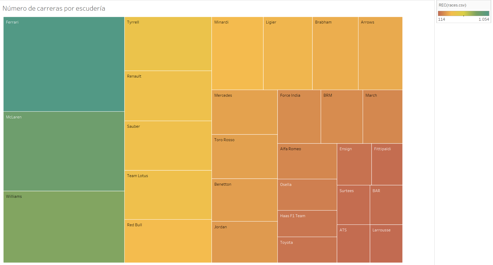

# ¿Estadísticamente, tiene ventaja los pilotos actuales frente a los clásicos?
---

Últimamente está de moda pensar que los pilotos actuales son mejores pilotos que los clásicos, apoyandose en que actualmente se están batiendo más recods que en todas las demás épocas del automobilismo.

Sin embargo quiero averiguar hasta que punto esto es cierto o está sesgado por la clase de datos que se está tomando.

En primer lugar hay que destacar que el número de carreras por temporada ha ido aumentando paulatinamente a lo largo del tiempo, y se ha pasado de 7 carreras que hubo en 1950 a las 23 que tenemos en la actualidad.

Ya solo teniendo en cuenta este dato, nos hace entender que el número de puntos que se reparten en la actualidad y el número de carreras que puede disputar un piloto a lo largo de su carrera es mucho mayor.

De igual manera cabría pensar que las escuderías que más carreras hayan disputado deberían de ser las que más puntos acumulan.

Sin embargo, esto no es así, ya que varias escuderías de las que más puntos han acumulado en la historia son equipos cuya formación está muy alejado de los años 50, como puede ser el caso de red bull o de Mercedes, que aunque esta última, si que que compitió cuando se creó la F1, se retiró de la competición desde el 55 hasta el 2010, año en el que volvieron a competir como constructores.

Por lo tanto, los pilotos que hayan nacido en años más cercanos al presente probablemente disputen más carreras que los pilotos clásicos y por lo tanto tendrán más probabilidades de obtener más puntos que los que nacieran a principios del siglo XX 

Y esto se puede ver en este gráfico que muestra los pilotos que más puntos han conseguido a lo largo de la historia. 

Como se puede ver, la mayoría de los pilotos han nacido en los años 80 o después, a excepción de alguna de las leyendas como Senna, Prost, Schumacher o Couthard.

Sin embargo, si comparamos el número de puntos conseguidos en relación a las vueltas realizadas, vemos que los grandes nombres de la F1 como Hamilton, Vetel, Alonso, o Verstapen destacan por conseguir sumar muchos puntos sin necesidad de correr muchas vueltas.

Por lo tanto y como conclusión, se puede afirmar que los pilotos actuales tienen ventaja estadística frente a los pilotos clásicos, ya que estos no tenían tantas oportunidades de sumar vueltas, puntos o podios, sin embargo, los grandes pilotos destacan por conseguir grandes resultados sin importar el  año en el que compiten.